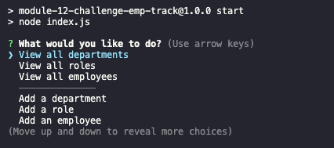

# Employee Tracker

## Description

A JavaScript implementation of a custom card game.  Card battle is both a fun solitaire and multiplayer game since you can play against the A.I.(novice).  The current version of the game [can be played on GitHub Pages by clicking here](https://card-battle.herokuapp.com/).

The goal of the game is eliminate your opponent by lowering their hitpoints to 0 first. All 10 cards have the same option to attack, defend, or skip.

Click a card to call it to action.  The game checks the attributes of the selected card: attack and defend.  If the selected card attacks, the opponent will have their hitpoints deducted by the attack subtracted by the defending cards defense.  You can regain hitpoints by selecting a card and using defense. The first player to 0 hitpoints loses. 

## Table of Contents 

- [Installation](#Installation)
- [Usage](#Usage)
- [Credits](#Credits)
- [License](#License)

## Installation

Installation instructions: `npm i`   
Log in to MySQL and in MySQL CLI: run `SOURCE db/schema.sql`  
If you want the starter data, log out of MySQL and in the CLI: run `npm run seed`  
Convert the .env.EXAMPLE to a regular .env file in the root directory with 
three variables with your respective credentials: (DB_NAME is already defined for you for this app) 
`DB_NAME='database name'` `DB_USER='user name'` `DB_PASSWORD='SQL password'`  

## Usage
After the installation instructions have been completed you can start the application by running `npm start`. If you seeded the database you can start viewing 
departments, roles, and employees. Otherwise, you can start adding all the info you want and update/delete data as needed.

What the application should look like when started:

## Credits

N/A 

## License

N/A
